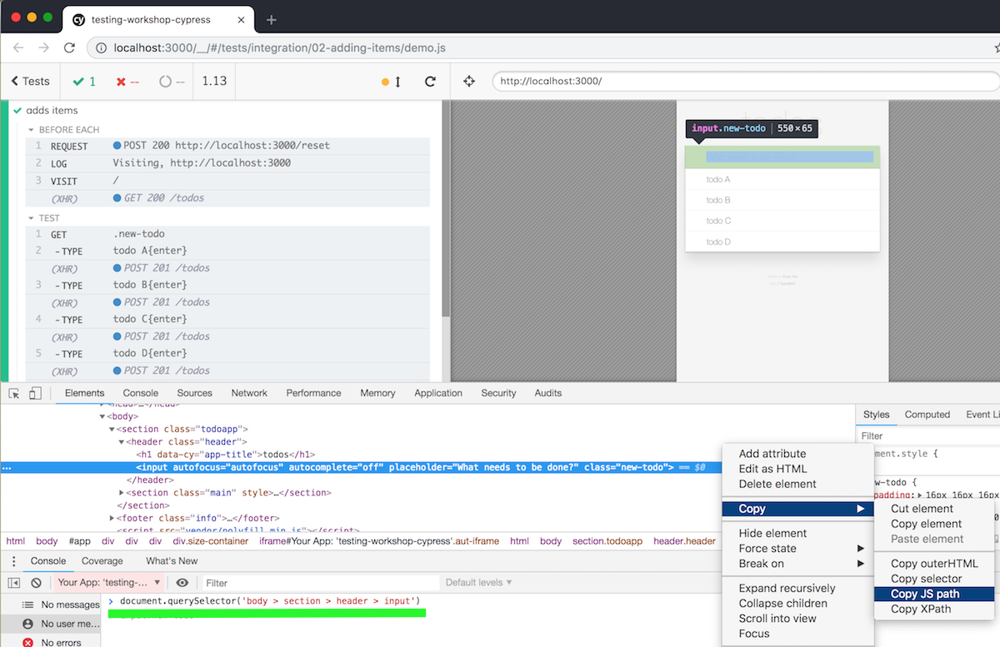
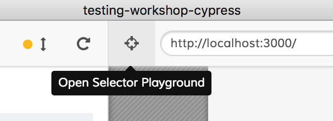
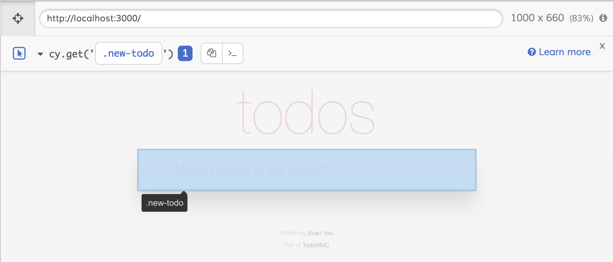
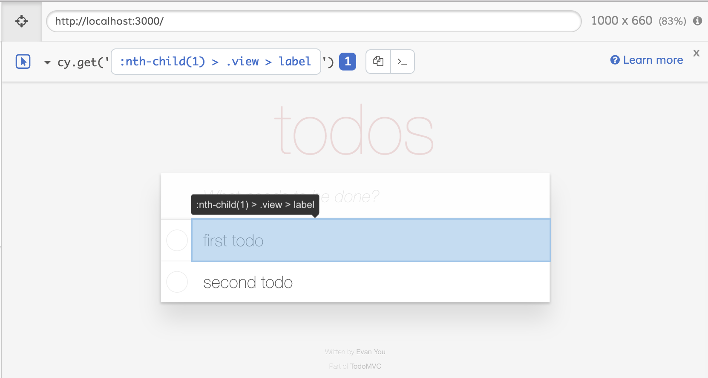
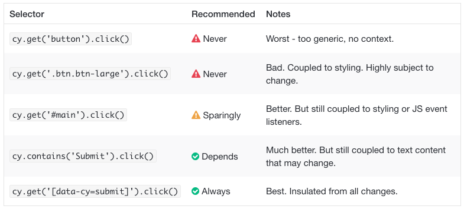
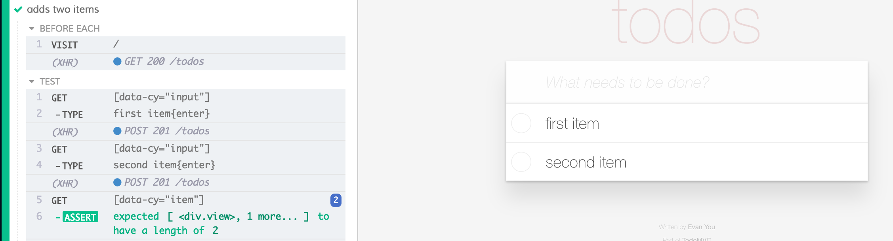

## ☀️ Part 3: Selector playground

### 📚 You will learn

- Cypress Selector Playground tool
- best practices for selecting elements

+++

- keep `todomvc` app running
- open `03-selector-playground/spec.js`

+++

> How do we select element in `cy.get(...)`?

- Browser's DevTools can suggest selector

+++

+++

Open "Selector Playground"

+++

Selector playground can suggest much better selectors.

+++

⚠️ It can suggest a weird selector

+++

Read [best-practices.html#Selecting-Elements](https://docs.cypress.io/guides/references/best-practices.html#Selecting-Elements)

+++

## Todo

- add test data ids to `todomvc/index.html` DOM markup
- use new selectors to write `cypress/integration/03-selector-playground/spec.js`

Note:
The updated test should look something like the next image

+++

+++

## 🏁 Conclusions

- Use Selector Playground
- follow [https://on.cypress.io/best-practices#Selecting-Elements](https://on.cypress.io/best-practices#Selecting-Elements)

+++

## Let's jump to resetting our application state

Jump to: [04-reset-state](?p=04-reset-state)