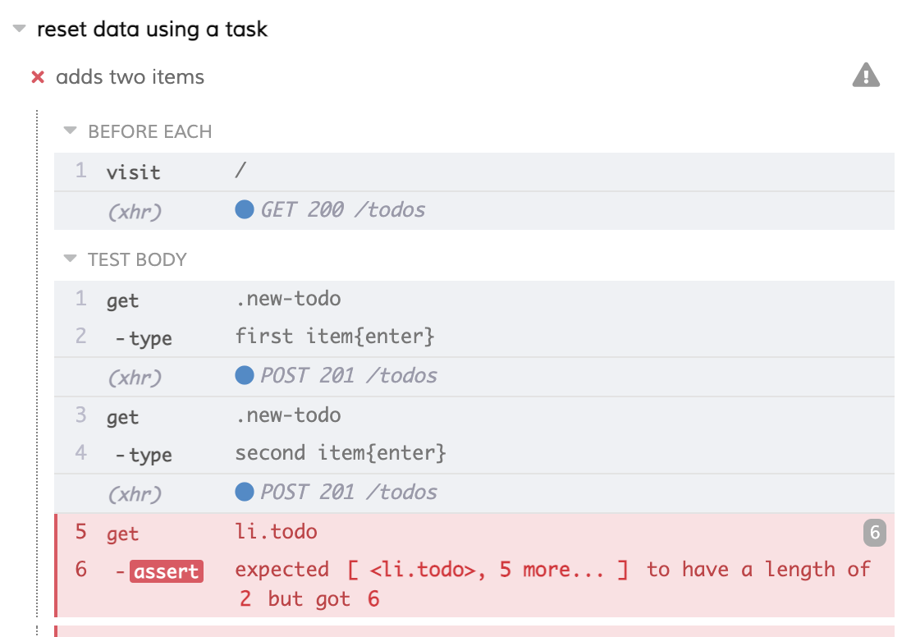
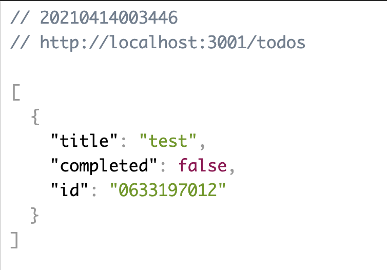

## ☀️ Part 4: Reset state data

### 📚 You will learn

- how one test can affect another test by leaving its data behind
- when and how to reset state during testing

+++

- keep `todomvc` app running
- open `cypress/integration/04-reset-state/spec.js`
- tests start to fail 😕

+++



+++

```js
beforeEach(() => {
  cy.visit('/')
})

const addItem = text => {
  cy.get('.new-todo').type(`${text}{enter}`)
}

it('adds two items', () => {
  addItem('first item')
  addItem('second item')
  cy.get('li.todo').should('have.length', 2)
})
```

+++

## Questions

- how to reset the database?
  - go to `todomvc/package.json`
  - try to reset it from command line
  - **note**: we are also using [json-server-reset](https://github.com/bahmutov/json-server-reset#readme) middleware which exposes a `/reset` endpoint

+++

## View the `/todos` endpoint

- GET request to `localhost:3001/todos`



+++

## Let's do a POST request

Use Postman or something similar

- POST request to `localhost:3001/reset` 
- GET request to `localhost:3001/todos`

+++

## TODO: use [cy.request](https://docs.cypress.io/api/commands/request) to make an XHR request

```js
it('adds two items', () => {
    // TODO use cy.request and call /reset endpoint with POST method and object {todos: []}
    cy.visit('/')

    addItem('first item')
    addItem('second item')
    cy.get('li.todo').should('have.length', 2)
  })
```

- modify `04-reset-state/spec.js` to make XHR call to reset the database
- before or after `cy.visit`?

+++

## Using cy.exec

```json
    "reset": "node reset-db.js",
    "reset:db": "npm run reset",
    "reset:database": "npm run reset"
```

See [`cy.exec`](https://on.cypress.io/exec)

+++

## TODO: use cy.exec to reset todos

```js
it('adds two items', () => {
    // TODO use cy.exec to call command to reset database
    cy.visit('/')

    addItem('first item')
    addItem('second item')
    cy.get('li.todo').should('have.length', 2)
  })
```

+++

## 🏁 Best practices

- reset state before each test to make sure that tests are not dependent to one another

+++

## Let's jump to creating custom commands

Jump to: [05-custom-commands](?p=05-custom-commands)