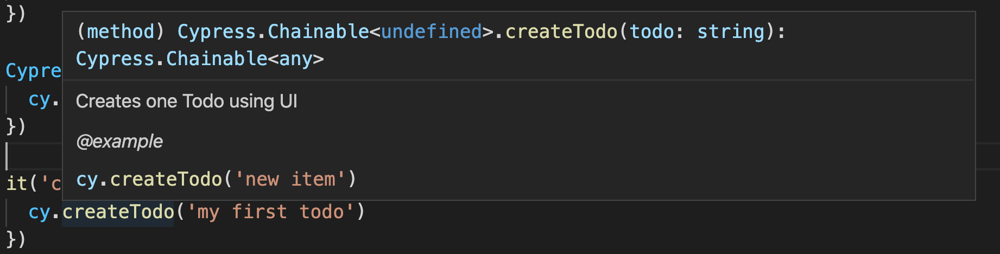

## ☀️ Part 5: Custom commands

### 📚 You will learn

- reusable functions
- adding new custom commands to `cy`
- TypeScript definition for new command (for intellisense)

+++

- keep `todomvc` app running
- open `cypress/integration/05-custom-commands/spec.js`

+++

### 💯 Code reuse and clarity

```js
beforeEach(function resetData () {
  cy.request('POST', '/reset', {
    todos: []
  })
})
beforeEach(function visitSite () {
  cy.visit('/')
})
```

Before each test we need to reset the server data and visit the page. We probably want to factor out `resetData` and `visitSite` into reusable functions every spec and test can use.

+++

### Question: Should we move them into `cypress/support/index.js`?

Now these `beforeEach` hooks will be loaded _before every_ test in every spec.

Is this a good solution?

+++

### Todo: export the `resetData` and `visitSite` as reusable functions from `cypress/support/hooks.js`

```js
// cypress/support/hooks.js
export function resetData () { ... }
export function visitSite () { ... }
```

⌨️ and update `spec.js` to import these functions beforeEach

```js
beforeEach(() => {
    resetData()
    visitSite()
})
```

A better solution, because only the spec file that needs these hooks can load them.

+++

## Use cases for custom commands

- share code in entire project without individual imports
- complex logic with custom logging into Command Log
  - login sequence
  - many application actions

📝 [on.cypress.io/custom-commands](https://on.cypress.io/custom-commands)

+++

Let's write a custom command to create a todo

```js
// instead of this
cy.get('.new-todo')
  .type('todo 0{enter}')
// use this
cy.createTodo('todo 0')
```

+++

## Todo: write and use "createTodo" from cypress/support/commands.js

```js
Cypress.Commands.add('createTodo', todo => {
  // create todo
})

it('creates a todo', () => {
  cy.createTodo('my first todo')
})
```

+++

## ⬆️ Make it better

- have IntelliSense working for `createTodo`

+++


## Todo: add `createTodo` to `cy` object

How: [https://github.com/cypress-io/cypress-example-todomvc#cypress-intellisense](https://github.com/cypress-io/cypress-example-todomvc#cypress-intellisense)

+++

⌨️ in file `cypress/support/index.d.ts`

```ts
/// <reference types="cypress" />
declare namespace Cypress {
  interface Chainable<Subject> {
    /**
     * Creates one Todo using UI
     * @example
     * cy.createTodo('new item')
     */
    createTodo(todo: string): Chainable<any>
  }
}
```

+++



Note:
Editors other than VSCode might require work.

+++

⚠️ tell Cypress to ignore ".d.ts" files using `ignoreTestFiles` in cypress.json or save ".d.ts" files outside the integration folder. Otherwise Cypress will try load ".d.ts" file as spec and without TypeScript loader it will fail.

+++

## Best practices

- Making reusable function is often faster than writing a custom command
- Know Cypress API to avoid writing what's already available

+++

## End of our workshop 💜

Jump to: [06-end](?p=06-end)